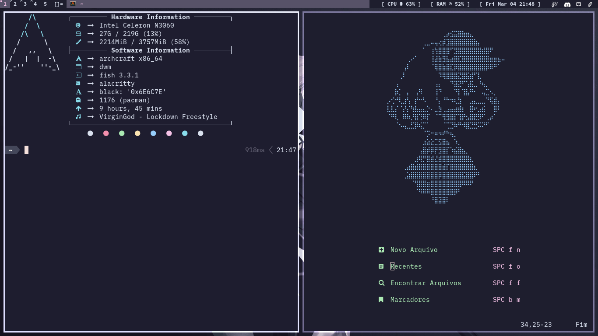

<center> <h1>DWM</h1> </center>

<center>

### my dwm config with catppuccin theme

## : Preview :



## : Dependencies :

|||
|:-:|:-:|
|Terminal(main)|st|
|Terminal|kitty|
|Launcher|dmenu|
|Compositor|picom|
|Wallpaper|feh|
|Others|ttf-hack, ttf-joypixels, libxft-bgra|
|||

## : Installing :

</center>

```
git clone https://github.com/spylima/dwm ~/config/dwm
cd ~/.config/dwm 
sudo cp ./dwm.desktop /usr/share/xsessions/
sudo make clean Install
mkdir ~/.dwm 
mv ./autostart.sh ~/.dwm/
```

## : Keybinds :

### Main

| Keybinding | Action |
|:------------:|:--------|
| Mod + 1-6 | switch to workspace |
| Mod + Shift + 1-6 | move focused window |
| Mod + 0 | See all opened windows |
| Mod + Shift + 0 | Fix window |
| Mod + D | dmenu |
| Mod + Enter | st |
| Mod + Shift + Enter | kitty |
| Mod + Shift + R | Restart DWM | 
| Mod + Shift + Q | Quit DWM |

### Layout

| Keybinding | Action |
|:------------:|:--------|
| Mod + Tab | Change between last focus |
| Mod + Space | Center Window |
| Mod + Shift + Space | Chage floating |
| Mod + (up) K-J (down) | Change focus |
| Mod + Shift + (up) K-J (down) | Move focused window |
| Mod + (left) H-L (right) | Change side area size |
| Mod + C | Close focused window |
| Mod + B | Hide or Show bar |
